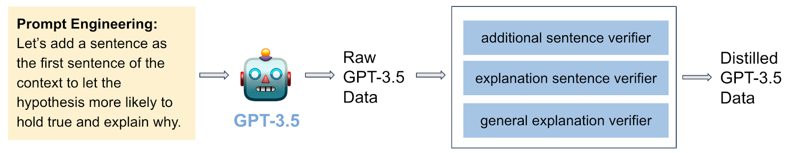

# Introduction
This is the data and code repository for our ACL 2023 paper ["Generic Temporal Reasoning with Differential Analysis and Explanation"](https://arxiv.org/pdf/2212.10467.pdf).

# TODAY
TODAY is our crowdsourced dataset. The TODAY dataset and its overall framework are designed to evaluate systems’ ability to make temporal predictions with plausible reasons.
## Dataset
We include the dataset under `data/`. 

# Models and Experiments
We provide our codebase to reproduce the experiment results reported in the paper.

## Pre-trained Models
- Download the entire directory `ptntime-pretrained-model` from [Google Drive](https://drive.google.com/drive/folders/1GirBYMWHJ13zqKl5qPcTjJQNJVtCfVaP?usp=sharing)
and put it under `model/ptntime-pretrained-model/`. 

- Download the entire directory `best_model_checkpoint` from [Google Drive](https://drive.google.com/drive/folders/1vvkDuqIWWu7mo4zh_aIjnxOhsXKfNSxW?usp=sharing)
and put it under `model/best_model_checkpoint/`. 

## Run Experiments
Work under `code/` directory (This is very important as we refer all paths relative to this working directory below).

- Install requirements by `pip install -r requirement.txt`

- To run and train the best ptntime model, use `sh train_ptntime.sh`

- To run and train the best T5 model, use `sh train_t5.sh`

- To run the baseline without TODAY, use `sh train_ptntime_wo_today.sh`

- To test the model, use `sh inference.sh`

## Generate LLM Supervision Signals


### Generate GPT-3.5 Data 
- Please follow the instructions and code in `GPT_today.ipynb`.

### Train Verifiers
- We pre-trained the explanation sentence verifier. Download the entire directory `ptntime_explanation_verifier` from [Google Drive](https://drive.google.com/drive/folders/1FUYb4ZRTbjCnvqejLLg7TymKrOtGuZqR?usp=sharing)
and put it under `model/ptntime_explanation_verifier/`.

- To train the general and additional sentence verifiers, use `sh train_ptntime_verifier.sh`.

### Distill GPT-3.5 Data 
- To distill the data, and further train with the distilled GPT-3.5 data, use `sh distill_ptntime.sh`.

# Citation
See the following paper: 
```
@misc{feng2023generic,
      title={Generic Temporal Reasoning with Differential Analysis and Explanation}, 
      author={Yu Feng and Ben Zhou and Haoyu Wang and Helen Jin and Dan Roth},
      year={2023},
      eprint={2212.10467},
      archivePrefix={arXiv},
      primaryClass={cs.CL}
}
```
